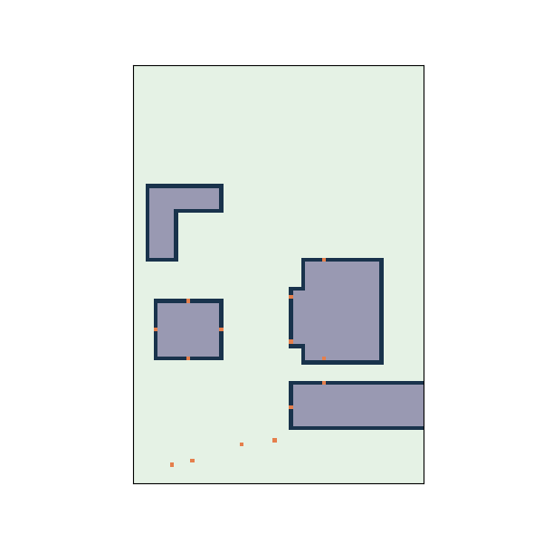

# Optimization Project

## Alex Williams and Davis Wing

This project aims to provide a fully automated means of identifying optimal sidewalk placements for any location, given locations of doors, buildings, and other points of interest.

